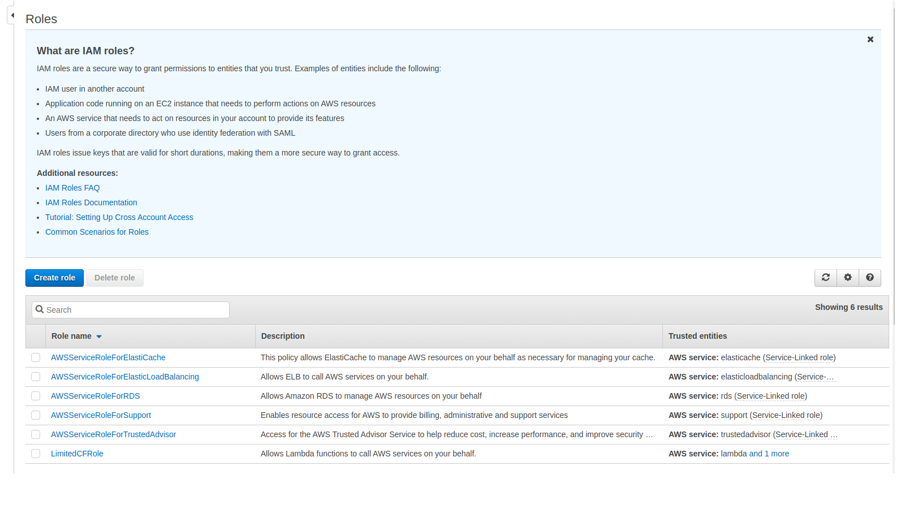
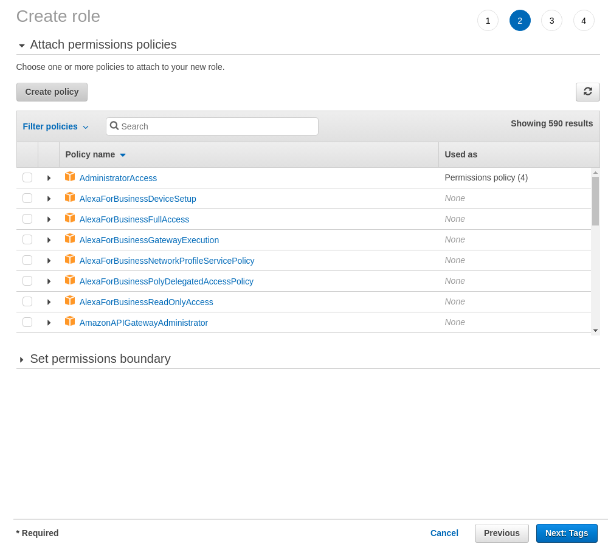
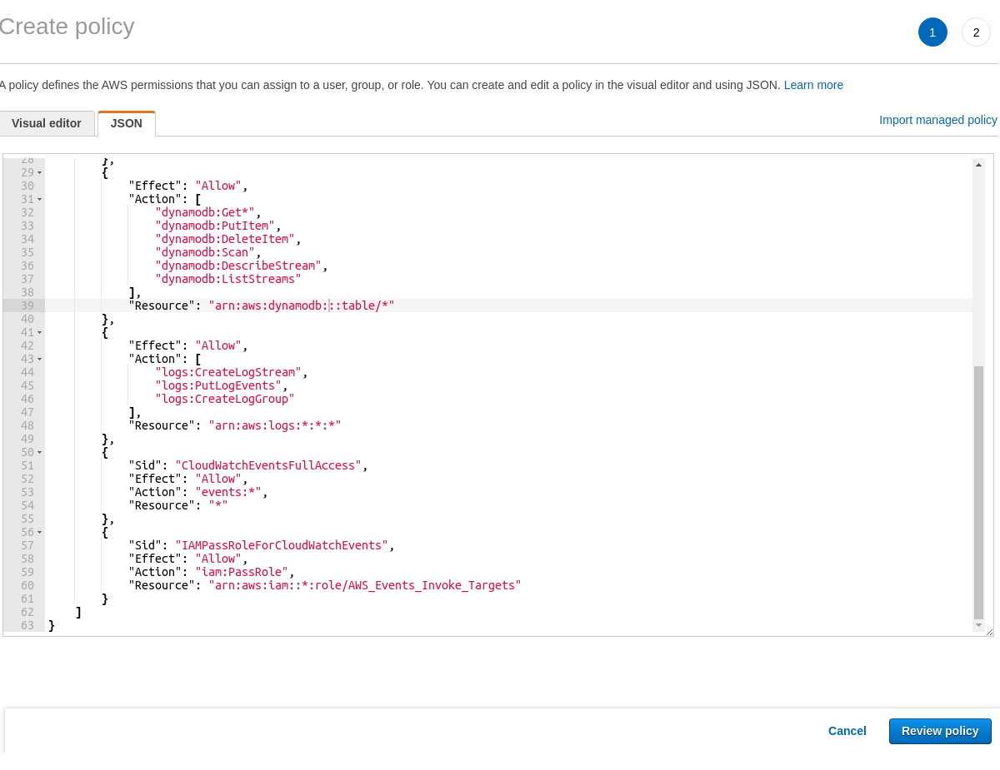
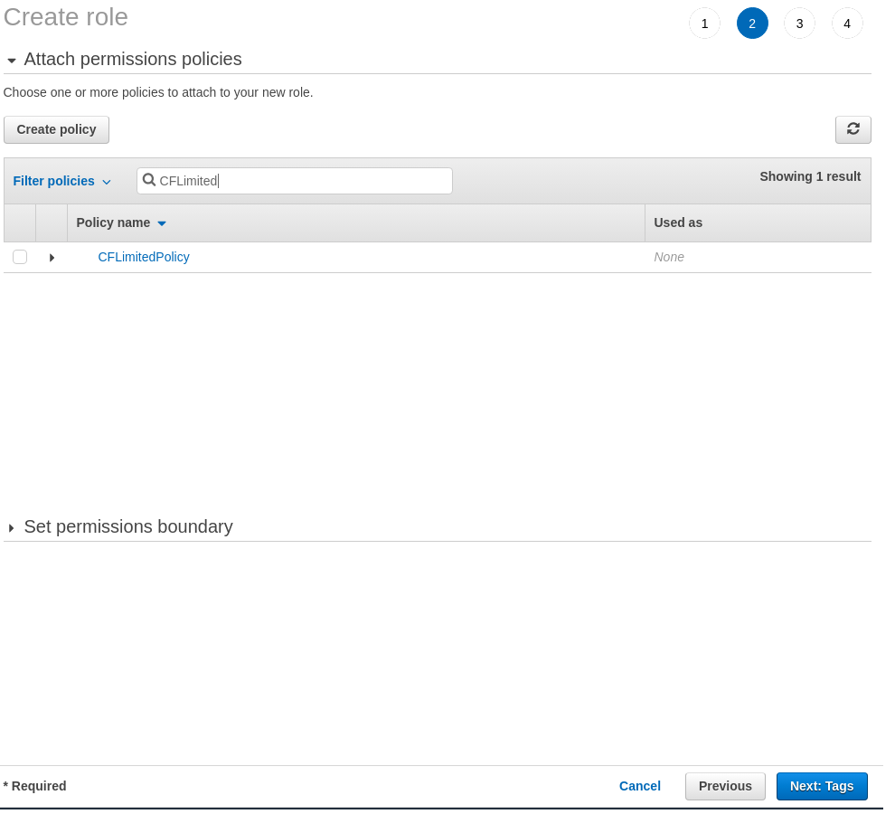
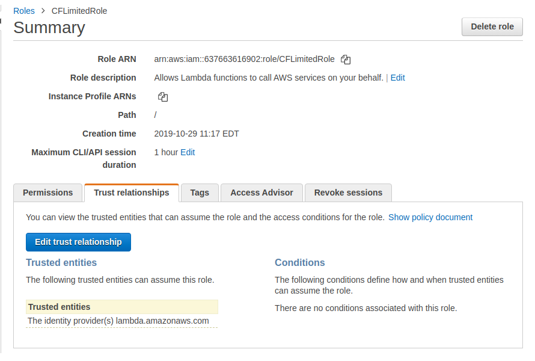

###############
Assume AWS Role
###############

Assuming a role in AWS is support both in `bert-runner.py` and `bert-deploy.py`. It starts with creating the Role in AWS Console through IAM Dashboard. With the Role Arn in hand, we'll insert it into `bert-etl.yaml` under our function `test_cf_disable`.

We'll begin with creating `LimitedCFRole` that'll be used to disable a Cloudfront distribution. This is where having an okay understanding of AWS IAM is usefull, for a complete overview of IAM, check out `Linux Academy <https://linuxacademy.com/course/aws-certified-developer-associate-2018/>`_. For the purpose of this tutorial, we'll walk only through steps required to create a Role an IAM user or Lambda will be able to assume. Than we'll return focus to `bert-etl` and show the steps on how to test the `assume-role <https://docs.aws.amazon.com/cli/latest/reference/sts/assume-role.html>`_ locally with `bert-runner.py` and then deploy to AWS Lambda with `bert-deploy.py`

Navigate to `AWS Console IAM Dashboard <https://console.aws.amazon.com/iam/home?region=us-east-1>`_, Roles section.

Click on Create Role,

.. image:: images/iam_roles_section_create_role.png
    :width: 450
    :alt: Amazon Web Services AWS IAM Dashboard open to Create Role

In the image above, `Lambda` is highlighted, select on `Lambda` then click `Next: Permissions` on the bottom right.

Click on `Create Policy`

In the JSON tab of `Create Policy`; paste the following and click `Review Policy`.

.. code-block:: json

    {
        "Version": "2012-10-17",
        "Statement": [
            {
                "Effect": "Allow",
                "Action": [
                    "acm:DescribeCertificate",
                    "acm:ListCertificates",
                    "acm:GetCertificate",
                    "acm:ListTagsForCertificate",
                    "acm:ImportCertificate",
                    "iam:ListServerCertificates"
                ],
                "Resource": "*"
            },
            {
                "Effect": "Allow",
                "Action": [
                    "cloudfront:UpdateDistribution",
                    "cloudfront:TagResource",
                    "cloudfront:ListDistributions",
                    "cloudfront:ListStreamingDistributions",
                    "cloudfront:GetDistribution",
                    "waf:ListWebACLs",
                    "waf:GetWebACL"
                ],
                "Resource": "*"
            },
            {
                "Effect": "Allow",
                "Action": [
                    "dynamodb:Get*",
                    "dynamodb:PutItem",
                    "dynamodb:DeleteItem",
                    "dynamodb:Scan",
                    "dynamodb:DescribeStream",
                    "dynamodb:ListStreams"
                ],
                "Resource": "arn:aws:dynamodb:::table/*"
            },
            {
                "Effect": "Allow",
                "Action": [
                    "logs:CreateLogStream",
                    "logs:PutLogEvents",
                    "logs:CreateLogGroup"
                ],
                "Resource": "arn:aws:logs:*:*:*"
            },
            {
                "Sid": "CloudWatchEventsFullAccess",
                "Effect": "Allow",
                "Action": "events:*",
                "Resource": "*"
            },
            {
                "Sid": "IAMPassRoleForCloudWatchEvents",
                "Effect": "Allow",
                "Action": "iam:PassRole",
                "Resource": "arn:aws:iam::*:role/AWS_Events_Invoke_Targets"
            }
        ]
    }
    

Lets name this Policy: `CFLimitedPolicy`

.. image:: images/iam_roles_section_create_policy_naming.png
    :width: 450
    :alt: Amazon Web Services AWS IAM Dashboard open to Create Policy Naming

With the `CFLimitedPolicy` created, lets go back to our browser tab where we started to create a role. One the left, above the data-table, click the refresh button.

Enter `CFLimitedPolicy` into the search bar. If it doesn't immediately show up, hit the refresh button above the right side of the data-table.

Click the checkbox and hit `Next: Tags`, `Next: Review`

.. image:: images/iam_roles_section_create_role_review.png
    :width: 450
    :alt: Amazon Web Services AWS IAM Dashboard open to Create Role, reviewing Role properties

Name the role `CFLimitedRole` and create the role. Navigate to `CFLimitedRole <https://console.aws.amazon.com/iam/home?region=us-east-1#/roles/CFLimitedRole?section=trust>`_ in a browser

For `bert-runner.py` to run locally, lets update the Policy Document with the JSON Template below. Remember to fill in the <AWS Account ID> and <Username> relative to your account.

.. code-block:: json

    {
      "Version": "2012-10-17",
      "Statement": [
        {
          "Effect": "Allow",
          "Principal": {
            "Service": "lambda.amazonaws.com"
          },
          "Action": "sts:AssumeRole"
        },
        {
          "Effect": "Allow",
          "Principal": {
            "AWS": "arn:aws:iam::<account_id>:user/<username>"
          },
          "Action": "sts:AssumeRole",
          "Condition": {}
        }
      ]
    }

Great, with all these steps above. Lets start working in `bert-etl` again. Let's clone a repository to begin

.. code-block:: bash

    $ conda create -n bert-etl-cf-disable python=3.7 pip
    $ conda activate bert-etl-cf-disable
    $ pip install bert-etl -U
    $ git clone git@github.com:jbcurtin/bert-etl-testing.git bert-etl-cf-disable
    $ cd bert-etl-cf-disable

Inside the directory `bert-etl-cf-disable`, open `bert-etl.yaml` in your editor and insert the following lines in `init_job_queue`

.. code-block:: yaml

    test_cf_disable:
        iam:
            execution_role_arn: arn:aws:iam::<aws-account-id>:role/CFLimitedRole
            
      
Lets test this function locally with

.. code-block:: bash

    bert-runner.py -m bert_test_iam
    
    
    
Chances are it'll fail because you've yet to create a Cloudfront distribution. Unfortuantly, that is beyond the scope of this walkthrough. You'll have to just trust the code works. :)

Go ahead and deploy to AWS Lambda

.. code-block:: bash

    bert-deploy.py -m bert_test_iam
     

Great!
